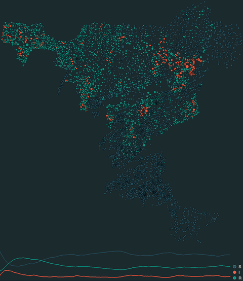

## Data preparation pipeline

* `src/download_GRID3_data.py` Download GeoJSON formatted settlement extents + shapefiles from GRID3 API
* `src/parse_settlements.py` Parse into a CSV-formatted list of locations + estimated populations
* `src/plot_locations.py` Plot scatter of settlement locations colored according to population

## Simulation configuration pipeline

* `src/configure_network.py` Build a k-nearest-neighbors directed graph and store in netwulf-readable formatting
* `src/simulate_SIRS.py` Simulate + visualize (in real time with epipack) a settlement-scale SIRS model of sustained transmission (example below)

